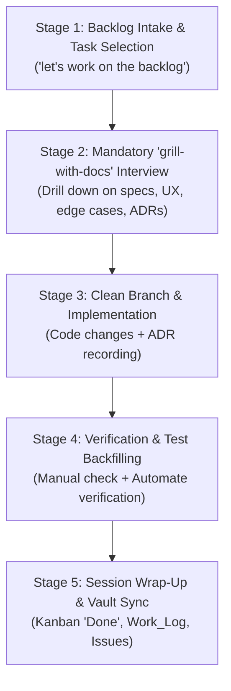

# Universal Human-Agent Project Management & Feature Delivery Skill

This skill provides a **generalized, project-agnostic operating system** for human-agent software development. It standardizes how AI agents discover project context, ingest backlog tasks, clarify requirements through interactive interviews, record architectural decisions, and maintain persistent state in Obsidian.

Vault Location: `/Users/supreethks/docs/obsidian/main-vault`

---

## 🚨 STRICT RULE: Project Isolation & File Boundary Enforcement

> [!CAUTION]
> **MANDATORY BOUNDARY ENFORCEMENT**: The agent **MUST NOT create, edit, modify, overwrite, move, or delete any files outside the designated project folder**.

1. **Strict Directory Confines**:
   - All Obsidian vault modifications must reside strictly within:
     `/Users/supreethks/docs/obsidian/main-vault/projects/<project-slug>/`
   - All codebase edits must reside strictly within the active project repository.
2. **Zero Vault Pollution**:
   - **NEVER** edit, create, or delete root-level vault notes (e.g. `Inbox.md`, `Todo.md`, `All Todos Summary.md`, `Tasks.md`, etc.).
   - **NEVER** touch other projects (`projects/<other-slug>/`), journals (`journal/`), daily logs, personal notes (`personal/`), finance (`finance/`), housing (`housing/`), or templates (`templates/`) unless the user explicitly provides an exact target filepath and direct instruction.
3. **No Large Raw Datasets in Vault**:
   - **NEVER** write large data dumps, bulk test sets (e.g. hundreds/thousands of extracted rows, raw CSV dumps, scraper payloads) directly into Obsidian markdown files. Obsidian is for human-readable notes, PRDs, architecture, and task tracking.
   - Large test artifacts and datasets must be saved in the **codebase directory** (e.g. `project-dir/data/` or as `.csv`/`.json` files in the repo), and only high-level summary tables or sampling (<20 items) should be referenced in Obsidian.
4. **Pre-Tool Verification**:
   - Before executing any file write, edit, replace, or deletion tool (`write_to_file`, `replace_file_content`, `run_command` with filesystem mutation), the agent **MUST** verify that the target path is strictly contained within `/Users/supreethks/docs/obsidian/main-vault/projects/<project-slug>/` or the active project workspace.
   - If an operation would touch files outside the project boundary, the agent MUST immediately abort the operation and request explicit confirmation.
5. **New File Creation Policy**:
   - When creating ANY new file in the vault (except journal notes), the filename MUST be prefixed with the current date in `YYYYMMDD - ` format (e.g., `20260825 - My Note.md`).
   - The file MUST include YAML front matter indicating it was created by an agent:
     ```yaml
     ---
     created_by: agent
     date: YYYY-MM-DD
     ---
     ```

---

## 1. Universal Project Structure

Every project in the Obsidian vault follows a standardized layout under `projects/<project-slug>/`:

```
/Users/supreethks/docs/obsidian/main-vault/projects/<project-slug>/
├── <project-slug>.md      # Master Dashboard (Metadata, quick links, live embeds)
├── Kanban.md              # Interactive Kanban board (Backlog, Next Up, In Progress, Review, Done)
├── PRD.md                 # Product Requirements Document & core specifications
├── Decisions.md           # Architecture Decision Records (ADR log)
├── Work_Log.md            # Reverse-chronological session logs by agents and human
└── Issues.md              # Known bugs, limitations, and technical debt backlog
```

---

## 2. Dynamic Project Resolution

Agents must **never hardcode project names**. Instead, dynamically resolve the project context at runtime:

1. **Git Repository Root**: Match the git repository folder name (`basename $(git rev-parse --show-toplevel)`).
2. **Working Directory**: Match the current directory name.
3. **Marker File**: Check for `.obsidian-project` file containing the project slug.
4. **Vault Scan / Prompt**: If unmatched or ambiguous, query the vault:
   ```bash
   python3 /Users/supreethks/.agents/skills/obsidian-project-tracker/scripts/backlog_helper.py list
   ```
   If the project does not exist yet in Obsidian, scaffold it automatically:
   ```bash
   python3 /Users/supreethks/.agents/skills/obsidian-project-tracker/scripts/scaffold_project.py "<slug>" --title "<Title>" --desc "<Description>"
   ```

---

## 3. The 5-Stage Human-Agent Collaboration Lifecycle



---

### Stage 1: Backlog Intake & Task Selection
**Trigger phrases**: `"let's work on the backlog"`, `"work on backlog"`, `"pick a task from backlog"`, `"what should we work on next?"`.

1. **Pull Tasks**: Run `backlog_helper.py` or inspect `Kanban.md` to retrieve tasks under `## 📋 Backlog` and `## 🎯 Next Up`:
   ```bash
   python3 /Users/supreethks/.agents/skills/obsidian-project-tracker/scripts/backlog_helper.py list <project> --column "Backlog"
   ```
2. **Present Clean Options**: Display the pending tasks cleanly in a numbered list with dates and context notes.
3. **Ask User to Select**: Invite the user to pick a task or specify custom scope.

---

### Stage 2: The Mandatory "grill-with-docs" Interview Phase
**CRITICAL**: Once a task is selected, **DO NOT start coding immediately**. The agent must conduct a structured requirements drill-down interview to eliminate ambiguity and prevent assumptions by triggering the `grill-with-docs` skill:

1. **User Experience & Interaction Flow**:
   - What is the step-by-step user journey from trigger to completion?
   - What UI states (idle, loading, empty, success, error) and transitions are expected?
   - Are there specific keyboard shortcuts, gestures, or window behaviors?
2. **Edge Cases & Failure Modes**:
   - What happens on missing data, network timeouts, invalid inputs, or background focus loss?
   - Are there platform-specific constraints (macOS window levels, iOS background limits, Android back stack)?
3. **Architecture & Technical Alignment**:
   - Which architectural layers will change (backend/Rust/DB vs frontend/React/Swift/Kotlin)?
   - Review `Decisions.md` and `PRD.md` to ensure proposed changes align with past ADRs.
4. **Verification & Testing Criteria**:
   - How will success be verified before shipping? (Unit tests, UI tests, physical device / webview checks).

Once the scope is agreed upon, move the task to `In Progress`:
```bash
python3 /Users/supreethks/.agents/skills/obsidian-project-tracker/scripts/backlog_helper.py move <project> --task "<snippet>" --to "In Progress"
```

---

### Stage 3: Clean Branch & Implementation
1. **Branch Hygiene**: Always start on a clean branch cut from the remote base (`forgejo/develop` or `origin/main`).
2. **Record Decisions (ADRs)**: When making a non-trivial architectural, data model, or library choice, append an entry to `Decisions.md`:
   ```markdown
   ### [ADR-00X] <Decision Title>
   - **Date**: YYYY-MM-DD
   - **Context**: <Problem, constraints, or motivation>
   - **Decision**: <What was chosen and why>
   - **Consequences / Tradeoffs**: <Positive and negative implications>
   ```

---

### Stage 4: Verification & Test Backfilling
1. **Run Project CI locally**: Match the exact CI workflow commands for the repo.
2. **Interactive / Hardware Verification**: Verify in the running app (webview, desktop window, or mobile device).
3. **Backfill Automated Tests**: Convert what was verified by hand into automated tests (Vitest, Playwright, Espresso, XCUITest).

---

### Stage 5: Session Wrap-Up & Remote PR / Obsidian Sync
Upon completing implementation and verification:
1. **Push Branch & Open Pull Request (MANDATORY)**:
   - Push the clean feature branch to the remote (`forgejo` or `origin`):
     ```bash
     git push -u <remote> <branch>
     ```
   - Automatically open the Pull Request targeting `develop` (or `main`) via the Forgejo REST API using stored credentials from `git credential-osxkeychain fill`:
     ```bash
     CRED=$(printf "protocol=http\nhost=<host:port>\n\n" | git credential fill 2>/dev/null)
     U=$(printf "%s\n" "$CRED" | sed -n 's/^username=//p')
     P=$(printf "%s\n" "$CRED" | sed -n 's/^password=//p')
     curl -s -u "$U:$P" -X POST -H "Content-Type: application/json" \
       -d '{"base":"develop","head":"<branch>","title":"<PR Title>","body":"<PR Body>"}' \
       http://<host:port>/api/v1/repos/<owner>/<repo>/pulls
     ```
2. **Update Kanban**:
   ```bash
   python3 /Users/supreethks/.agents/skills/obsidian-project-tracker/scripts/backlog_helper.py move <project> --task "<snippet>" --to "Done"
   ```
3. **Append to `Work_Log.md`** (Prepend under `# Work Log`):
   ```markdown
   ### YYYY-MM-DD — [Agent Session] <Task Title>
   - **Goal**: <Summary of goal>
   - **Changes Implemented**: <Key changes made>
   - **Files Modified**: `<path/to/file1>`, `<path/to/file2>`
   - **Verification**: <Manual verification notes and test suite results>
   - **Pull Request**: Opened [PR #X](http://<host:port>/<owner>/<repo>/pulls/X) targeting `develop`.
   - **Next Steps / Blockers**: <Follow-ups or unblocked work>
   ```
4. **Log Discovered Tech Debt**: If bugs or cleanup tasks were identified during development, log them in `Issues.md`.

---

## 4. Relationship with Project-Specific Skills

This general skill handles **project management, backlog intake, requirements refinement, and documentation sync**. 

Platform-specific implementation details are delegated to specialized skills:
- **`vimark-feature-workflow`**: Tauri v2, React desktop UI, Spotlight-style window focus, Nx monorepo commands, Forgejo PR CI.
- **`mobile-feature-workflow`**: Android (Gradle/Compose) + iOS (Xcode/SwiftUI), mobile device MCP verification, store release rules.
- **Custom / Web Repos**: Standard Git + package manager test commands.

---

## 5. CLI Quick Reference

```bash
# List backlog tasks for detected or specified project
python3 /Users/supreethks/.agents/skills/obsidian-project-tracker/scripts/backlog_helper.py list [project] --column "Backlog"

# Move task between Kanban columns
python3 /Users/supreethks/.agents/skills/obsidian-project-tracker/scripts/backlog_helper.py move [project] --task "<query>" --to "In Progress"
python3 /Users/supreethks/.agents/skills/obsidian-project-tracker/scripts/backlog_helper.py move [project] --task "<query>" --to "Done"

# Add a quick task to project backlog
python3 /Users/supreethks/.agents/skills/obsidian-project-tracker/scripts/backlog_helper.py add [project] --task "Short task summary"

# Sync journal #hashtags to Kanban boards
python3 /Users/supreethks/.agents/skills/obsidian-project-tracker/scripts/sync_daily_ideas.py

# Scaffold a brand new project workspace
python3 /Users/supreethks/.agents/skills/obsidian-project-tracker/scripts/scaffold_project.py "<slug>" --title "<Title>" --desc "<Description>"
```
