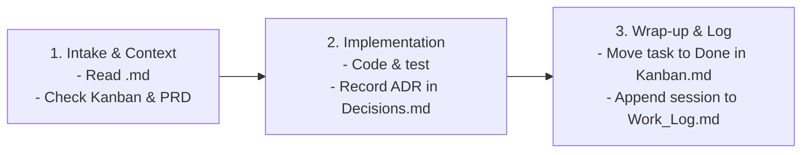

# Obsidian Project Tracker Skill

This skill defines the protocol for AI agents to interact with the project tracking system in the user's Obsidian vault located at:
`/Users/supreethks/docs/obsidian/main-vault`

---

## 1. Project Location & Structure

Every tracked project has a dedicated folder under `projects/<project-name>/`:

```
/Users/supreethks/docs/obsidian/main-vault/projects/<project-name>/
├── <project-name>.md      # Master Dashboard (Quick-Switcher keyboard index, metadata, live embeds)
├── Kanban.md              # Interactive Kanban board (Obsidian Kanban plugin)
├── PRD.md                 # Product Requirements Document & specs
├── Decisions.md           # Architecture Decision Records (ADR log)
├── Work_Log.md            # Reverse-chronological session logs by agents/human
└── Issues.md              # Known bugs & tech debt backlog
```

### Main Projects Directory Mapping:
- **ViMark** (Tauri Desktop App) $\rightarrow$ `/Users/supreethks/docs/obsidian/main-vault/projects/vimark/`
- **Yorely** (iOS / Android Memories App) $\rightarrow$ `/Users/supreethks/docs/obsidian/main-vault/projects/yorely/`
- **Kagga** (Mankutimmana Kagga Reader App) $\rightarrow$ `/Users/supreethks/docs/obsidian/main-vault/projects/kagga/`

If working in a new or different repo, detect the project name from the repository root folder name or `.obsidian-project` file.

---

## 2. Agent Operating Lifecycle

Whenever an agent works on a project task, it follows this 3-step lifecycle:



### Step 1: Session Intake (Read Context)
At the start of the session:
1. Read `projects/<project-name>/<project-name>.md` and `projects/<project-name>/Kanban.md`.
2. Locate the active task in `🚧 In Progress` or `🎯 Next Up`.
3. Read relevant sections of `PRD.md` or `Decisions.md` to avoid re-litigating past architectural choices.

### Step 2: During Implementation (Record Decisions)
If you make a non-trivial architectural, product, or dependency decision, append an entry to `Decisions.md`:
```markdown
### [ADR-00X] <Decision Title>
- **Date**: YYYY-MM-DD
- **Context**: <Problem, constraints, or motivation>
- **Decision**: <What was decided and chosen>
- **Consequences / Tradeoffs**: <Positive and negative implications>
```

### Step 3: Session Wrap-up (Update Kanban & Work Log)
When the task / PR is completed:
1. **Update `Kanban.md`**:
   - Move the completed task item into the `## ✅ Done` column.
   - Format: `- [x] @{YYYY-MM-DD} <Task description>`
2. **Append to `Work_Log.md`** (Prepend at the top of the log entries, under `# Work Log`):
   ```markdown
   ### YYYY-MM-DD — [Agent Session] <Feature/Bug Title>
   - **Goal**: <What was planned>
   - **Changes Implemented**: <Key changes made in the codebase>
   - **Files Modified**: `<path/to/file1>`, `<path/to/file2>`
   - **Verification**: <Tests passed, manual UI/hardware verification notes>
   - **Next Steps / Blockers**: <What remains or is unblocked>
   ```
3. **Update `Issues.md`**:
   - If a new bug, limitation, or tech debt was discovered during the task, add it under `## Unresolved Issues` or `## Tech Debt`.

---

## 3. Scaffolding New Projects (CLI)

To scaffold a new project workspace in Obsidian, run:
```bash
python3 /Users/supreethks/.agents/skills/obsidian-project-tracker/scripts/scaffold_project.py "<project-name>" --title "<Display Title>" --desc "<Short Description>"
```
